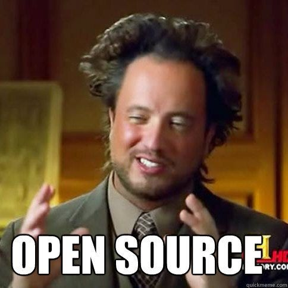

## Heschel Computer Science 2025-2026

Important links:

1. Shay Howe's [HTML & CSS](https://learn.shayhowe.com/html-css/) book
1. Al Sweigart's [Automate the Boring Stuff](https://automatetheboringstuff.com/).
1. You can use https://pythontutor.com to visualize what python is doing "step-by-step".

## About the Instructor

|||
|-|-|
| Name | AJ Holzer (call me AJ) |
| Email | aj.holzer@heschel.org |
| Office |Middle School |
| Office Hours | See [Issue #2] (https://github.com/teacher-aj/CSHeschel-new/issues/2) |

about me:
1. Grew up in Highland Park IL (~30 Minutes north of Chicago)
1. I studied neuroscience and computer science at a small college in California (a little more than double the size of Heschel Highschool)
1. I've worked at a lab in Israel, researching hyperbaric oxygen therapy. This work was mentioned in [Joe Rogan Podcast](https://www.youtube.com/watch?v=9Bon5c5DEI4) and [CBS](https://www.cbsnews.com/news/promising-treatment-for-ptsd-hyperbaric-oxygen-therapy/) 
1. I taught 7th grade science last year (I teach it this year as well!)
1. I visited five national parks this summer! But my favorite place I visitied this year was Big Sur. 

## About the Course

**General Information:**

1. There are no prerequisites for this course.
    1. This course is more practical (and fun!) than the other CS courses.
        1. You will:
            1. Use LLMs (e.g. ChatGPT) to code.
                (And learn what they can/can't do.)
            1. Count the number of computers in North Korea connected to the internet.
            1. Build your own Twitter clone.
            2. Get updates on business news in the world of technology
        1. This course is especially designed to connect computer science to other subjects like
            1. economics,
            1. government,
            1. business, and
            1. science.
               
     But if you end up really liking it, I hope it sparks a greater interest in computer science in general. But even if you don't, I hope it can give you some practicial skills to use in the field that you may be interested in. I hope it will help you in your classes, and in your application to college.     

**Primary Learning Objectives:**

1. **Automate boring tasks** <-- this is a hacker's primary goal

    

1. Create static and dynamic web pages
1. Understand the basics of many programming languages:
    1. HTML
    1. CSS
    1. JavaScript
    1. SQL
    1. and **Python** <-- this is the main focus of the course

**Secondary Learning Objectives:**

1. Introduction to [hacker culture](http://www.catb.org/esr/faqs/hacker-howto.html) and [open source software](https://opensource.com/resources/what-open-source)

    

1. Understand basic:
    1. internet infrastructure
    1. common programming jargon
        1. ["front end" versus "back end" development](https://www.coursereport.com/blog/front-end-development-vs-back-end-development-where-to-start)
        1. [test driven development](https://streamhacker.com/2009/02/05/test-driven-development-in-python/)
    1. [accessible development](https://www.w3.org/standards/webdesign/accessibility)
        1. allow blind people to use webpages
        1. allow non-English speaking / non-Americans to use your software
    1. web security
        1. technical details (you will learn to commit fraud in this class... but obviously you shouldn't!)
        1. social implications
        1. government policy
        1. legal issues
    1. [search engine optimization](https://moz.com/beginners-guide-to-seo)
1. Use real-world programming tools
    1. Python libraries actually in use at [FAANG companies](https://www.investopedia.com/terms/f/faang-stocks.asp)
    1. GitHub 
    1. LLMs

**Textbook:**

There is nothing to buy for this class.
All of our references are free.

1. Shay Howe's [Learn to Code HTML & CSS](https://learn.shayhowe.com/html-css/).
1. Al Sweigart's [Automate the Boring Stuff with Python](https://automatetheboringstuff.com/).
1. Lots of other online resources as provided in the weekly schedule.

**Grades:**

| category                      | points/assignment         | *approximate* percentage |
| ----------------------------- | ------------------------- | ---- |
| Classwork (daily)             | `2**1` |                  | 30%  |
| quizzes (weekly)              | `2**2` - `2**3`           | 30%  |
| projects (every 2-3 weeks)    | `2**3` - `2**6`           | 40%  |

I have designed this course to be low-stress but **very** challenging.

1. The course is low-stress because you have full control over what your grade will be.
    1. **No midterm/final exam.**
       Weekly quizzes ensure you don't fall behind on material, and if you bomb a quiz it's not a big deal.

       1. Quizzes will be open note, but closed computer.

       1. Final project due during last week of semester.

    1. Most weekly labs are automatically graded by Python.
       Keep working on them until you get 100%.

    1. Projects/homework will have TONs of extra credit opportunities.

        Lots of "choose your own adventure" style assignments where you get to decide which tasks you want to complete.
       
1. The material is intrinsically *very* hard.

    1.Probably harder than most other elective options
    1. That's why CS/DS majors get paid so much money... there's not many people willing to work hard enough to master these concepts.
    1. The key to success is make the most in-person instruction time. If I have to worry about your behavior in class you will likely worry about your grade

        Historically:
        1. To achieve an A, I estimate that a student will have to
               - recieve maximum classwork points 95%+ of classes
               - spend about 2 hours per week on content outside of class
               - Use class time efficiently

## Classwork Policy (30% of Course Grade)

### Core Expectations
- The **most important** value in this class is **being present** and **creating space for learning** to happen.
- I do **not** care if you don't fully understand the material, as long as I can see that:
  - You're **genuinely trying**
  - You're **engaged during class time**

### Misuse of Class Time
- **Class time is valuable.** Using it for anything other than learning is not acceptable.
- This includes behaviors that **disrupt learning**—either your own or your classmates’.

### How You Earn Classwork Points
- Each day you're in class, you start with **2 classwork points**.
- You will **lose 1 point** if you:
  - Disrupt the class
  - Insult another student
  - Play games on your Chromebook
  - Interrupt me or another student while they are speaking
  - Anything else that detracts from our classroom goal
- You will **lose the second point immediately** if:
  - You repeat any of the above behaviors within the same class period
  - You argue about the loss of a classwork point
- You will recieve +1 point if you arrive every day and go above and beyond in participation. You will see in your gradebook if you recieved this point
 

### Final Notes
- I am **reasonable and understanding**—you’re kids and school days are long!
- If you ever need to take a break during class, **just let me know**.
- If you have any questions or concerns about this policy, please come talk to me.
**If you lose classwork points for a majority of class periods (50%+ at 1 or less) your grade will be capped at a C**

1. The projects are designed to be fun, real-world projects. Here are the current plans for projects over the course of the semester:

    |     | Project                 | Difficulty    |
    | --- | ----------------------- | ------------- |
    | 0   | Building a Webpage      | Easy          |
    | 1   | Data visualization      | Medium        |
    | 2   | Scraping ebay           | Medium        |
    | 3   | Twitter clone           | Hard          |

    Our projects emphasize techniques that LLMs cannot do by themselves.
    (And I will teach you how to use LLMs productively to improve your work.)

Your final grade will be computed according to the following table,
with one caveat.

| If your grade satisfies          | then you earn |
| -------------------------------- | ------------- |
| 95 &le; grade                    | A             |
| 90 &le; grade < 95               | A-            |
| 87 &le; grade < 90               | B+            |
| 83 &le; grade < 87               | B             |
| 80 &le; grade < 83               | B-            |
| 77 &le; grade < 80               | C+            |
| 73 &le; grade < 77               | C             |
| 70 &le; grade < 73               | C-            |
| 67 &le; grade < 70               | D+            |
| 63 &le; grade < 67               | D             |
| 60 &le; grade < 63               | D-            |
| 60 > grade                       | F             |

**Late Work Policy:**

You lose `2**(i-1)` points on every assignment,
where `i` is the number of days late.

Do not expect partial credit for incomplete assignments.
It is much better to submit a correct assignment late than an incorrect one on time.

**Collaboration Policy:**

You are encouraged to discuss all labs and projects with other students,
subject to the following constraints:

1. You must be the person typing in all code for your assignments.
1. If you ask someone for help: you may show your code to the other person, but you may not view their code.

You may use any online resources you like as references (including LLMs!) without restriction.

Basically, I'm trusting you all to be adults.
You are ultimately responsible for ensuring you learn the material!
So do what will help you learn best.

> **WARNING:**
> All material in this class is cumulative.
> If you work "too closely" with another student on an assignment,
> you won't understand how to complete subsequent assignments,
> and you will quickly fall behind.
> You should view collaboration as a way to improve your understanding,
> not as a way to do less work.

## Accommodations for Disabilities

I've tried to design the course to be as accessible as possible for people with disabilities.
(We'll talk a bit about how to design accessible software in class too!)
If you need any further accommodations, please ask.

I want you to succeed and I'll make every effort to ensure that you can.

<!--
